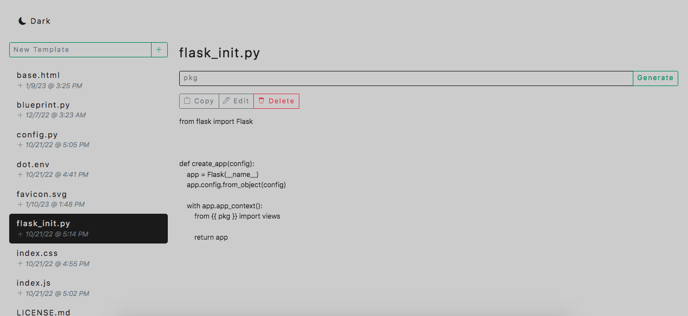

#  ClipBin

Save important snippets of code or text that you commonly copy and paste. Locally-hosted and ran from your browser of choice. Files of any type can be stored in your home directory. Can also be used from the command-line for greater productivity.

### Usage

1. Clone this repo
2. Set configuration:
    1. Run `vi .env` in root of repo
    2. Set your `home_dir` setting (can be any local directory of your choice): `home_dir=[DIRECTORY]`
    3. Option configuration: `port` (defaults to 5000)
3. Run command `python3 setup.py develop` to install
4. Run command `clipbin --help` to see all options:

    Usage: clipbin [OPTIONS] COMMAND [ARGS]...

      ClipBin

    Options:
      --help  Show this message and exit.

    Commands:
      copy2clipboard   Copy template to the clipboard.
      copy2file        Copy template to file.
      create-template  Create a template.
      delete-template  Delete a template.
      web              Launch web interface.
